# AWS Containerized Microservices Project

I built this project to understand how large applications like Amazon
and Flipkart run their backend services independently without one
affecting the other. Before this project I knew Docker existed but
I had never actually containerized a real application and deployed
it on AWS. Building this changed that completely.

---

## Why I Built This

Every cloud job description I read mentioned Docker, ECS, and
microservices. I could explain what they were theoretically but
I could not build one from scratch. I wanted to fix that.

The idea was simple -- build two separate services that work
independently:
- A product catalog that returns product information
- A shopping cart that lets users add and remove items

Both services needed to run in containers on AWS, connect to their
own databases, and be accessible through a single Load Balancer.

---

## What I Built

Two independent microservices where:

1. User sends a request to the Application Load Balancer
2. Load Balancer reads the URL path and routes accordingly
3. Requests to /products go to the Product Service
4. Requests to /cart go to the Cart Service
5. Each service reads and writes its own DynamoDB table
6. Both services run on ECS Fargate with no servers to manage
7. Auto Scaling adds or removes containers based on traffic
8. CloudWatch captures all logs and sends alerts when needed

---

## Architecture

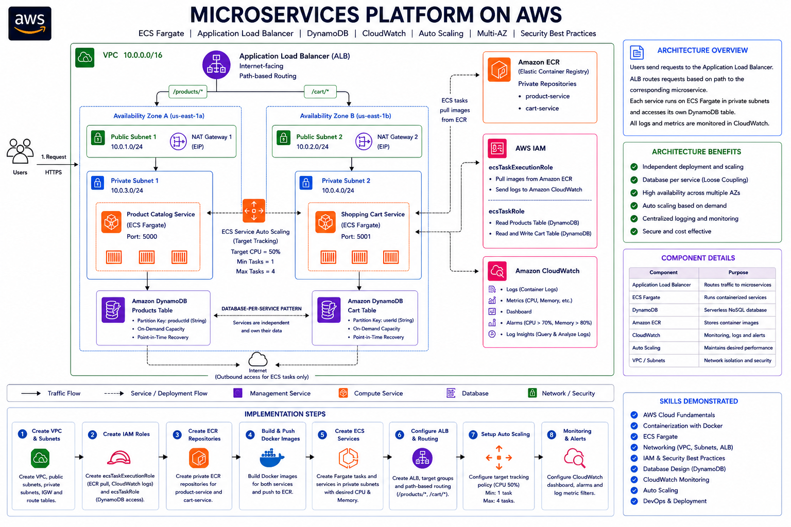

---

## AWS Services I Configured

### Amazon VPC
I created a custom VPC (10.0.0.0/16) with 4 subnets across
2 availability zones -- 2 public subnets for the Load Balancer
and 2 private subnets for the containers.

The thing that clicked for me here is WHY containers go in
private subnets. The Load Balancer is the only thing that should
face the internet. Even if someone finds the container IP address
they cannot reach it directly -- they have to go through the
Load Balancer. I had read about defense in depth before but
building this made me understand what it actually means.

### AWS IAM Roles
This part confused me initially because ECS requires two separate
roles and they look similar.

The ecsTaskExecutionRole is for ECS itself -- to pull the Docker
image from ECR and send logs to CloudWatch. Without this the
container never starts.

The ecsTaskRole is for the application code running inside the
container -- to read and write DynamoDB. Without this every
DynamoDB call fails with Access Denied.

Once I understood that one role is for ECS and the other is for
my code, it made complete sense. Each role has only the permissions
it actually needs -- nothing more.

### Amazon ECR
I pushed Docker images to private ECR repositories -- one for
each service. The main thing I learned here is that the login
token expires after 12 hours. I had to re-run the login command
the next day when the token expired. In production a CI/CD
pipeline would handle this automatically.

### Amazon ECS Fargate
I chose Fargate because I did not want to manage servers. I just
tell AWS how much CPU and memory the container needs and AWS
handles the rest. No EC2 instances, no patching, no capacity
planning. I set 0.5 vCPU and 1GB memory for each container.

### Application Load Balancer
One Load Balancer handles both services using path-based routing.
/products goes to the product service and /cart goes to the cart
service. This was one of my favourite parts of the project because
it showed me how companies run multiple services behind a single
entry point without users knowing there are two separate systems.

### Amazon DynamoDB
Each service has its own table. The product service only ever
touches the products table and the cart service only ever touches
the cart table. This is called database per service -- each
service owns its data completely. If one table has a problem
the other service keeps running normally.

### Amazon CloudWatch
Since you cannot SSH into a Fargate container, CloudWatch logs
are the only way to see what is happening inside. I set up log
groups for both services, a dashboard showing CPU and memory,
alarms that email me when CPU goes above 70 percent or memory
above 80 percent, and Log Insights queries to search through
logs quickly.

### Auto Scaling
I configured both services to scale between 1 and 4 containers
based on CPU. The target is 50 percent -- if CPU goes above that
AWS adds containers, if it drops below AWS removes them. I set
the scale-in cooldown to 120 seconds so containers are not
removed too quickly when traffic briefly drops.

---

## API Endpoints

### Product Service (port 5000)
```
GET /health          Returns service health status
GET /products        Returns all products from DynamoDB
GET /products/{id}   Returns single product by ID
```

### Cart Service (port 5001)
```
GET    /health                     Returns service health status
GET    /cart/{userId}              Returns cart for a user
POST   /cart                       Adds item to cart
DELETE /cart/{userId}/{productId}  Removes item from cart
```

---

## Real Test Results

### Product Service
```
GET /products
Response:
{
    "count": 3,
    "products": [
        {"id": "1", "name": "Laptop", "price": 999.99},
        {"id": "2", "name": "Wireless Mouse", "price": 29.99},
        {"id": "3", "name": "Desk Chair", "price": 299.99}
    ]
}
```

### Cart Service
```
POST /cart
Body:
{
    "userId": "user1",
    "productId": "1",
    "productName": "Laptop",
    "quantity": 1,
    "price": 999.99
}

Response:
{
    "message": "Item added to cart",
    "cart": {
        "userId": "user1",
        "items": [
            {
                "productId": "1",
                "productName": "Laptop",
                "quantity": 1,
                "price": 999.99
            }
        ]
    }
}
```

| Test | Result |
|---|---|
| GET /products returns all items | Passed |
| GET /products/1 returns Laptop | Passed |
| POST /cart adds item to cart | Passed |
| GET /cart/user1 shows added item | Passed |
| Health checks passing on both services | Passed |
| Rolling deployment with zero downtime | Passed |
| Auto Scaling active on both services | Passed |
| CloudWatch alarms firing correctly | Passed |

---

## Screenshots

### ECS Services Running
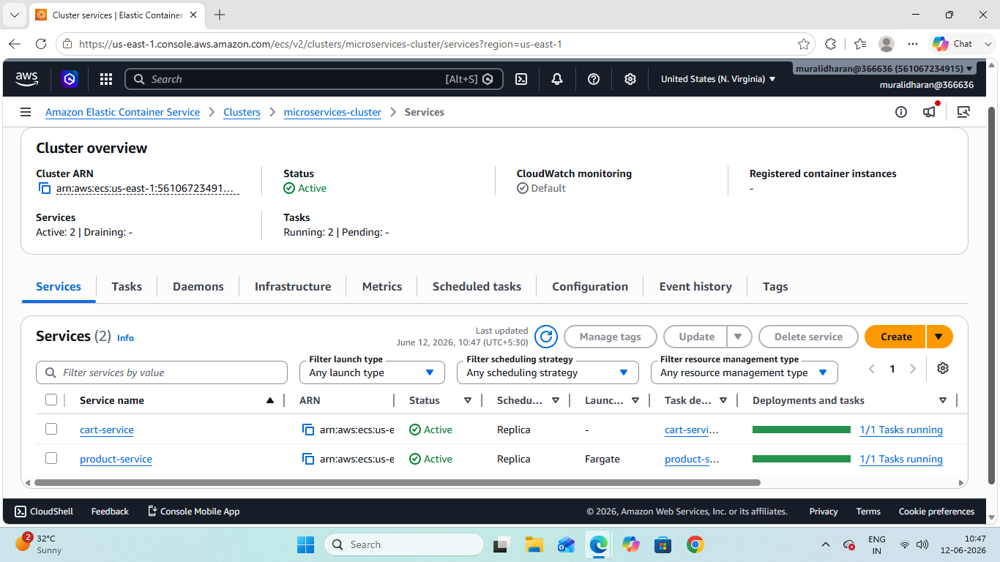

### Product API Response
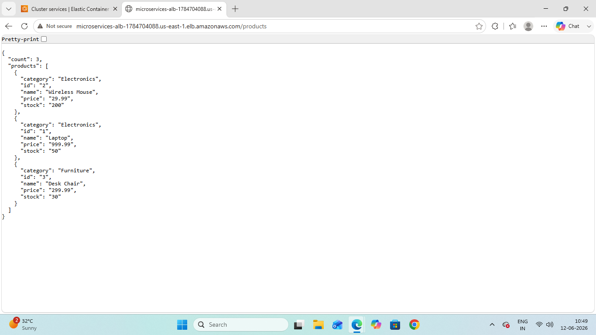

### Cart API Response
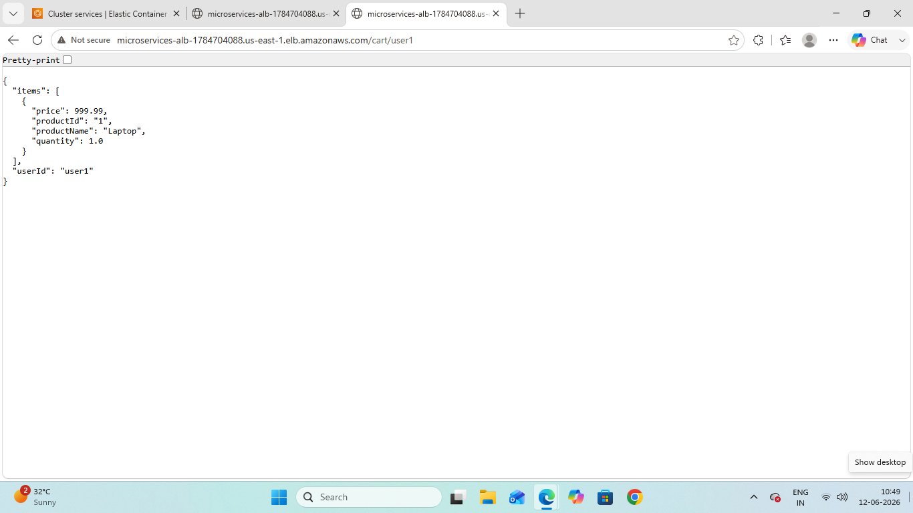

### DynamoDB Tables
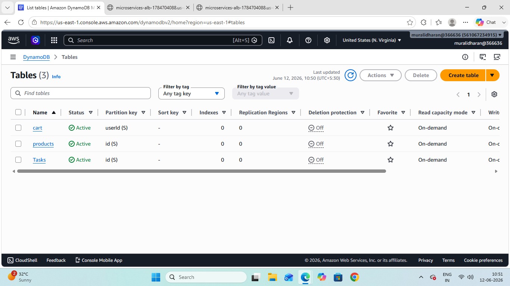

### Load Balancer Active
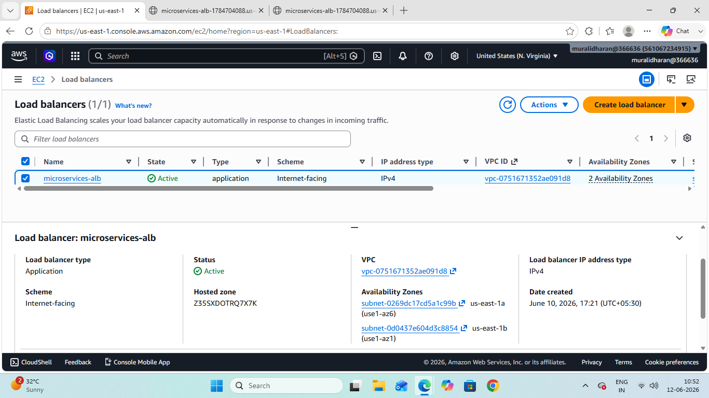

### Product Target Group Healthy
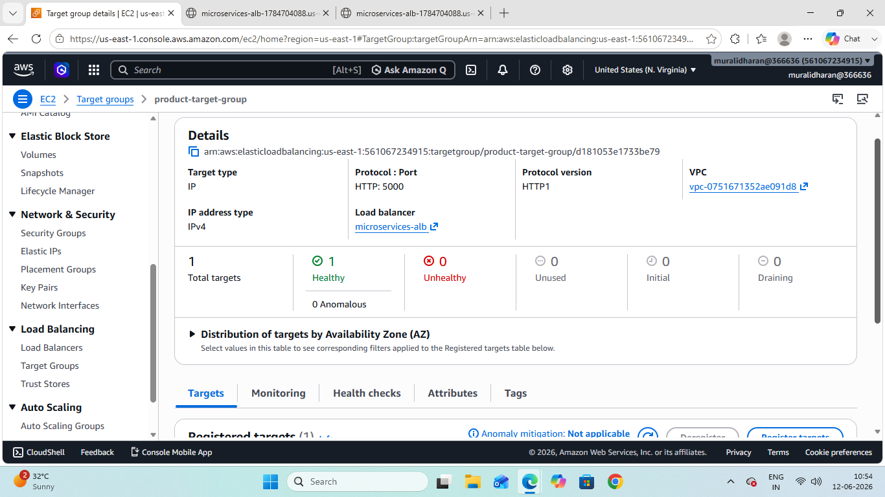

### Cart Target Group Healthy
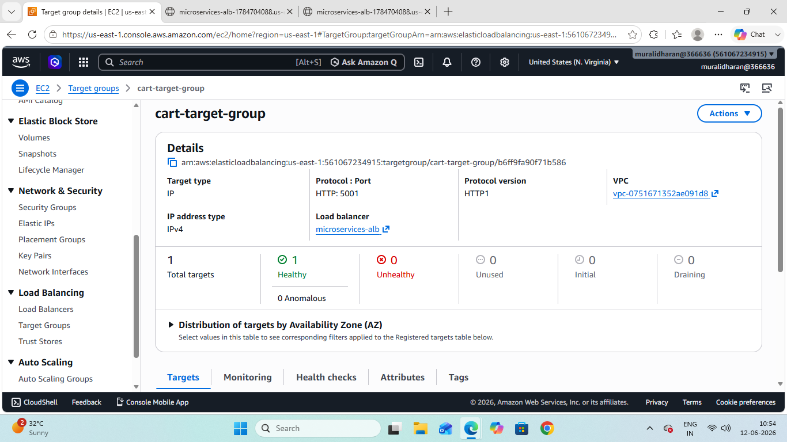

### CloudWatch Dashboard
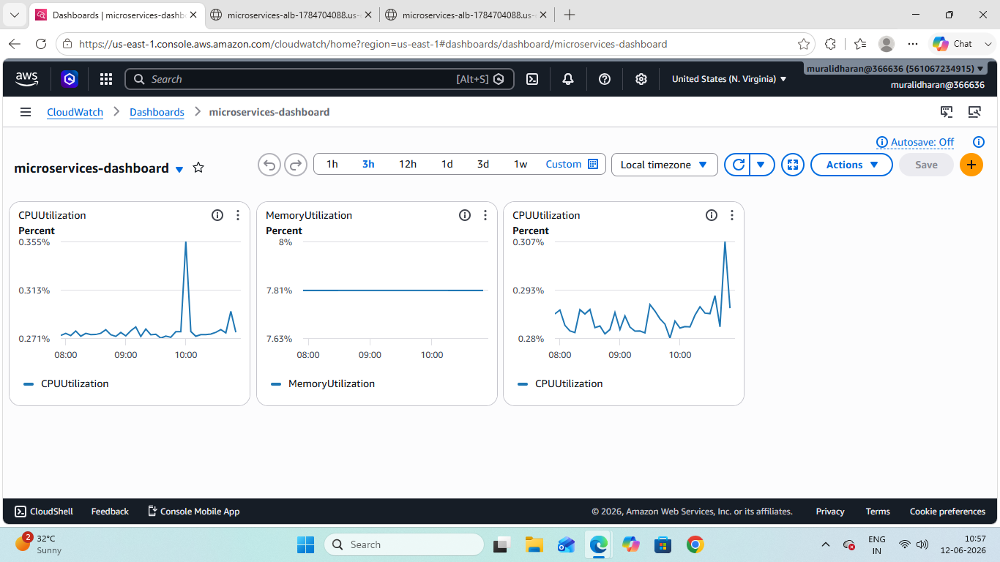

### Auto Scaling Policy


### CloudWatch Alarms
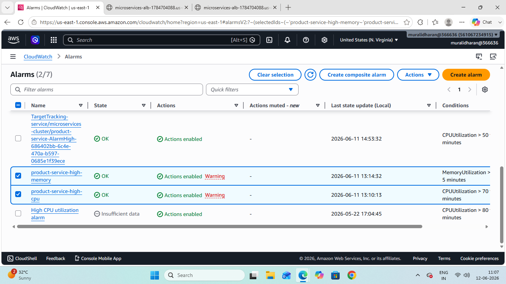

### ECR Repositories
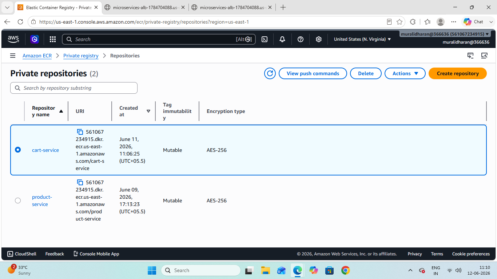

---

## Challenges and How I Fixed Them

### Challenge 1 -- Cart Service Health Checks Kept Failing

After deploying the cart service, the containers kept showing
as Draining instead of Healthy in the target group. I kept
waiting but it never changed.

I went through it step by step:

First I checked CloudWatch logs -- Flask was running fine on
port 5001. The container itself was healthy.

Then I checked the health check settings -- protocol HTTP,
path /health, port 5001. Everything looked correct.

Then I checked the ECS security group and found it.

When I created the security group during the networking setup,
I only added port 5000 for the product service. Port 5001 for
the cart service was never added. The Load Balancer was trying
to reach the container on port 5001 but the security group was
silently blocking it.

I added one inbound rule -- Custom TCP, port 5001, source
alb-security-group -- and the container became Healthy within
a minute.

This was the most valuable debugging experience of the whole
project. The lesson I took from it is that when health checks
fail in ECS, check the security group inbound rules before
anything else.

### Challenge 2 -- Could Not Find ECR Repository in Console

After creating the ECR repository I searched for it in the
console and could not find it anywhere. I spent time confused
before I noticed the region selector in the top right corner
was showing ap-south-1 (Mumbai) instead of us-east-1 (Virginia)
where I had created the repository.

AWS resources only appear in the region they were created in.
Now I always check the region first before creating or searching
for anything.

---

## What I Learned

Before this project I thought microservices just meant splitting
an app into smaller pieces. Building this showed me that true
microservices means each service is completely independent --
its own codebase, its own container, its own database, its own
scaling policy.

The security group debugging taught me something I will never
forget. When something is not working in AWS the problem is
almost always permissions or security groups. Checking logs
first tells you if the application is healthy. If the app is
healthy but traffic is still not reaching it -- check the
security group.

The two IAM roles confused me until I built this. Now when
someone asks me about ECS IAM I can explain it clearly because
I hit the exact error that happens when you get it wrong.

---

## Future Improvements

### Terraform
Recreate the entire infrastructure using Terraform so everything
that was built manually through the console is defined as code.
This is something the project guide specifically recommends --
build through the console first to understand each service, then
write it as Infrastructure as Code. The Terraform code will go
in a /terraform folder in this same repository.

### CI/CD with GitHub Actions
Add a GitHub Actions workflow so every git push automatically
builds the Docker image, pushes it to ECR, and deploys to ECS.
Right now every deployment involves running several manual
commands. A pipeline would handle all of that automatically.

### HTTPS
Add an SSL certificate using AWS Certificate Manager and attach
it to the Load Balancer so the API runs on HTTPS instead of HTTP.

### API Authentication
Add Amazon Cognito so users have to authenticate before
accessing cart endpoints.

---

## Cleanup

To stop AWS charges, delete resources in this order:

1. ECS Services (set desired count to 0 first)
2. ECS Cluster
3. Application Load Balancer and Target Groups
4. NAT Gateway and release the Elastic IP
5. ECR Repositories
6. DynamoDB Tables
7. CloudWatch Log Groups, Dashboard and Alarms
8. VPC, Subnets, Internet Gateway and Route Tables
9. IAM Roles and Policies
10. Security Groups

---

## Author

**Muralidharan M N**

AWS Certified Cloud Practitioner | AWS re/Start Graduate

LinkedIn: https://www.linkedin.com/in/muralidharan-m-n-78a2522b8

GitHub: https://github.com/muralidharan666666-dev
